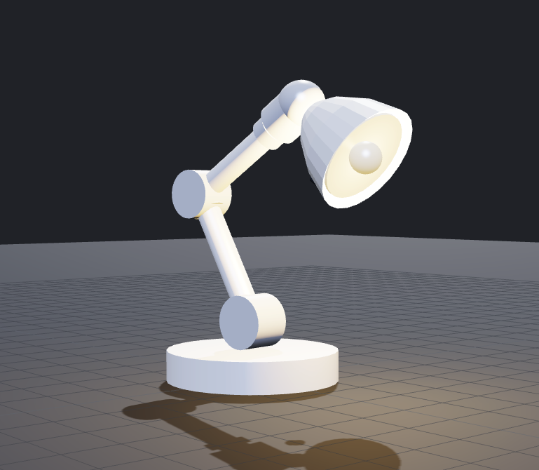
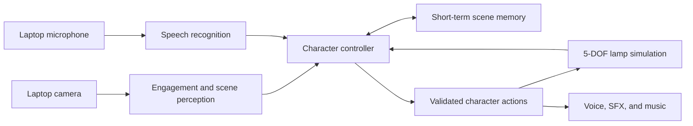

# Live Character Robot

An expressive, camera-aware character built around a simulated five-degree-of-freedom lamp robot. The project combines visual engagement, spoken interaction, short-term scene memory, goal-directed behavior, motion, light, voice, sound effects, and music into one continuous experience.

> **Project status:** In development. The supplied robot runs in MuJoCo with validated joint limits and its first safe expressive motion.



## Demo scenario

The planned demonstration follows one coherent interaction:

1. A person looks toward the lamp, and the lamp turns to acknowledge them.
2. The lamp responds with coordinated motion, light, and sound.
3. The person speaks to the lamp through the laptop microphone.
4. The lamp observes and remembers an object shown through the laptop camera.
5. The person later asks about that object, and the lamp recalls it.
6. The person gives a scene-related goal. The lamp uses current visual evidence and the spoken goal to choose and execute a bounded action sequence.
7. The lamp observes the scene again before reporting whether the goal is complete.
8. When the person looks away, the lamp disengages and returns to idle.

## Proposed architecture

The implementation will use explicit component boundaries and a small character state machine. Perception and language components may recommend actions, but a deterministic controller will validate joint limits and own body execution.



The initial action vocabulary will be intentionally small, for example:

- `LOOK_AT`, `LOOK_LEFT`, and `LOOK_RIGHT`
- `NOD` and `RETURN_TO_IDLE`
- `SET_LIGHT`
- `SPEAK`, `PLAY_SFX`, and `PLAY_MUSIC`
- `OBSERVE_SCENE` and `REMEMBER_OBJECT`

## Robot model

The supplied URDF defines five controllable revolute joints:

| Joint | Purpose |
| --- | --- |
| `base_yaw_joint` | Rotate the lamp body left and right |
| `shoulder_pitch_joint` | Raise or lower the lower arm |
| `elbow_pitch_joint` | Bend the upper arm |
| `neck_yaw_joint` | Turn the lamp head left and right |
| `head_pitch_joint` | Tilt the lamp head up and down |

The controller will respect the position and velocity limits declared in the URDF. This keeps model-generated decisions separate from safe motion execution and provides a path toward a physical robot implementation.

## Target environment

The submitted application will target Ubuntu 24.04 LTS with:

- Four CPU cores
- 8 GB of RAM
- No discrete GPU or CUDA dependency
- A camera, microphone, and speaker
- Wi-Fi for any configured cloud services

Development may also be performed on macOS. Final setup and run instructions will be tested against the Ubuntu target assumptions.

## Local setup

Python 3.12 is required. From the repository root:

```bash
python3.12 -m venv .venv
source .venv/bin/activate
python -m pip install --upgrade pip
python -m pip install -e '.[dev]'
```

Run the initial application entry point:

```bash
live-character-robot
```

Inspect the five imported joints and their position limits:

```bash
live-character-robot inspect-model
```

Open the lamp in MuJoCo's interactive viewer:

```bash
live-character-robot simulate
```

Close the viewer window to stop the simulation command.

On macOS, play the first expressive nod animation with MuJoCo's viewer-aware
Python launcher:

```bash
.venv/bin/mjpython -m live_character_robot animate nod
```

On Ubuntu, use the regular project command:

```bash
live-character-robot animate nod
```

Preview local camera engagement detection:

```bash
live-character-robot camera
```

Look toward the camera for approximately one second to enter `ENGAGED`. Look
away or leave the frame for approximately two seconds to return to `IDLE`.
Press `Q` or `Esc` while the preview is focused to close it. Camera frames are
processed locally and are not stored or transmitted.

On macOS, the built-in camera and iPhone Continuity Camera may share camera
index `0`. Choose the MacBook camera in the macOS prompt or disconnect the
iPhone; the application tolerates a short interruption while macOS switches
the video source. If the local device order differs, select an index explicitly:

```bash
live-character-robot camera --index 0
```

Run the checks:

```bash
pytest
ruff check .
```

## Repository layout

```text
.
├── CHALLENGE.md                 # Authoritative challenge brief
├── SUBMISSION.md                # Deliverables and evaluation criteria
├── README.md
├── pyproject.toml               # Package metadata and dependencies
├── src/live_character_robot/    # Application package
├── tests/                       # Automated tests
└── robot/
    ├── dummy_lamp_5dof.urdf     # Supplied robot description
    ├── dummy-lamp.png           # Supplied reference image
    └── assets/
        └── lamp_shade.stl       # Supplied lamp shade mesh
```

Simulation, perception, character behavior, audio assets, and the technical note will be added as implementation progresses.

## Development roadmap

- [x] Import and verify the supplied starter files
- [x] Select and validate the simulation stack
- [x] Load the URDF and implement safe motion primitives
- [x] Add camera-based engagement detection
- [ ] Add speech input and voice output
- [ ] Add scene observation and short-term memory
- [ ] Add goal-to-action planning with post-action observation
- [ ] Coordinate motion, light, voice, sound effects, and music
- [ ] Add graceful offline and service-error behavior
- [ ] Measure engagement reliability, latency, CPU, and memory use
- [ ] Test setup on the Ubuntu target
- [ ] Complete the two-page technical note

## Challenge documents

See [CHALLENGE.md](CHALLENGE.md) for the full requirements and [SUBMISSION.md](SUBMISSION.md) for the required deliverables and evaluation criteria.

## AI-assisted development

AI-assisted development tools may be used during implementation. The final submission will document the architecture, behavior, measurements, data handling, technical decisions, and known limitations, and all generated code will be reviewed and tested.
