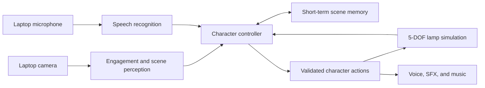

# Live Character Robot

An expressive, camera-aware character built around a simulated five-degree-of-freedom lamp robot. The project combines visual engagement, spoken interaction, short-term scene memory, goal-directed behavior, motion, light, voice, sound effects, and music into one continuous experience.

> **Project status:** Functional end-to-end prototype. Final Ubuntu hardware validation remains.


## Demo scenario

The planned demonstration follows one coherent interaction:

1. A person looks toward the lamp, and the lamp turns to acknowledge them.
2. The lamp responds with coordinated motion, light, and sound.
3. The person speaks to the lamp through the laptop microphone.
4. The lamp observes and remembers an object shown through the laptop camera.
5. The person later asks about that object, and the lamp recalls it.
6. The person gives a scene-related goal. The lamp uses current visual evidence and the spoken goal to choose and execute a bounded action sequence.
7. The lamp observes the scene again before reporting whether the goal is complete.
8. When the person looks away, the lamp disengages and returns to idle.

## Architecture

The implementation uses explicit component boundaries and a small character controller. Perception and language components recommend bounded actions, while a deterministic controller validates joint limits and owns body execution.



The action vocabulary is intentionally small:

- `LOOK_AT`, `LOOK_LEFT`, and `LOOK_RIGHT`
- `NOD` and `RETURN_TO_IDLE`
- `SET_LIGHT`
- `SPEAK`, `PLAY_SFX`, and `PLAY_MUSIC`
- `OBSERVE_SCENE` and `REMEMBER_OBJECT`

## Design choices and tradeoffs

The supplied URDF describes the lamp's links, joints, geometry, and limits; it
does not prescribe the simulator, perception stack, interaction protocol,
planner, memory model, or controller. Those software boundaries were selected
for this implementation.

| Choice | Why it fits | Tradeoff |
| --- | --- | --- |
| MuJoCo simulation | Imports the five-DOF model, exposes joint limits, and provides an interactive CPU-capable viewer. | The simulation does not validate real actuator dynamics, collision safety, or physical lighting. |
| Deterministic named actions | Language and vision select only predefined, joint-limited motions, keeping body execution explainable and safe. | The lamp cannot invent arbitrary movements or understand unrestricted goals. |
| Local `faster-whisper` speech recognition | Avoids API cost and audio upload, works from a local model cache, and meets the CPU-only target. | Model initialization adds latency and transcription consumes noticeable CPU. |
| Fixed phrase and goal parsing | Produces predictable behavior that is straightforward to test and demonstrate. | Natural-language coverage is intentionally narrower than a cloud language model. |
| Local HSV color observation | Runs quickly without a GPU or cloud image transfer. | Supports six colors and is sensitive to lighting, exposure, saturation, and color boundaries. |
| One-item in-memory scene memory | Keeps the demonstration private, bounded, and easy to reason about. | Memory disappears when the session ends and cannot recall multiple objects. |
| Shared camera engagement monitor | Makes engagement, object observation, and disengagement part of one continuous character session. | Frontal-face detection can be affected by glare, occlusion, pose, and camera quality. |
| Operating-system voice plus synthesized audio | Provides offline voice, sound effects, and music without bundled copyrighted media. | Voice quality and available speech engines differ between macOS and Ubuntu. |

## Robot model

The supplied URDF defines five controllable revolute joints:

| Joint | Purpose |
| --- | --- |
| `base_yaw_joint` | Rotate the lamp body left and right |
| `shoulder_pitch_joint` | Raise or lower the lower arm |
| `elbow_pitch_joint` | Bend the upper arm |
| `neck_yaw_joint` | Turn the lamp head left and right |
| `head_pitch_joint` | Tilt the lamp head up and down |

The controller will respect the position and velocity limits declared in the URDF. This keeps model-generated decisions separate from safe motion execution and provides a path toward a physical robot implementation.

## Target environment

The submitted application will target Ubuntu 24.04 LTS with:

- Four CPU cores
- 8 GB of RAM
- No discrete GPU or CUDA dependency
- A camera, microphone, and speaker
- Wi-Fi for any configured cloud services

Development may also be performed on macOS. Final setup and run instructions will be tested against the Ubuntu target assumptions.

## Local setup

Python 3.12 is required. From the repository root:

```bash
python3.12 -m venv .venv
source .venv/bin/activate
python -m pip install --upgrade pip
python -m pip install -e '.[dev]'
```

Run the initial application entry point:

```bash
live-character-robot
```

Inspect the five imported joints and their position limits:

```bash
live-character-robot inspect-model
```

Open the lamp in MuJoCo's interactive viewer:

```bash
live-character-robot simulate
```

Close the viewer window to stop the simulation command.

On macOS, play the first expressive nod animation with MuJoCo's viewer-aware
Python launcher:

```bash
.venv/bin/mjpython -m live_character_robot animate nod
```

On Ubuntu, use the regular project command:

```bash
live-character-robot animate nod
```

Preview local camera engagement detection:

```bash
live-character-robot camera
```

Look toward the camera for approximately one second to enter `ENGAGED`. Look
away or leave the frame for approximately two seconds to return to `IDLE`.
Press `Q` or `Esc` while the preview is focused to close it. Camera frames are
processed locally and are not stored or transmitted.

On macOS, the built-in camera and iPhone Continuity Camera may share camera
index `0`. Choose the MacBook camera in the macOS prompt or disconnect the
iPhone; the application tolerates a short interruption while macOS switches
the video source. If the local device order differs, select an index explicitly:

```bash
live-character-robot camera --index 0
```

List the available microphone and speaker devices:

```bash
live-character-robot audio-devices
```

Record five seconds from the default microphone and play the clip back:

```bash
live-character-robot microphone --seconds 5 --playback
```

The test clip is saved under `recordings/`, which is excluded from Git.

Transcribe an existing recording locally:

```bash
live-character-robot transcribe recordings/microphone-test.wav
```

Or record and transcribe one bounded five-second utterance:

```bash
live-character-robot listen --seconds 5
```

Make the simulated lamp respond to a bounded spoken command on macOS:

```bash
.venv/bin/mjpython -m live_character_robot react --seconds 5
```

Try saying `hello`, `no`, `look up`, or `go to sleep`. Speech is matched only
to predefined, joint-limited motions. If no phrase is recognized, the lamp
stays still. The MuJoCo viewer closes shortly after the reaction finishes.

Keep one simulator window open and respond to multiple spoken commands:

```bash
.venv/bin/mjpython -m live_character_robot session --seconds 5
```

Run the complete engagement-to-disengagement demonstration on macOS:

```bash
.venv/bin/mjpython -m live_character_robot demo --seconds 5
```

Look directly at the Mac camera until the character greets you. Use the spoken
commands below while remaining visible. When finished, look fully away or leave
the frame; after stable absence, the character returns to idle and the demo
ends. The integrated demo owns one shared camera stream for engagement and
scene observation, and never saves camera frames.

The session listens in bounded five-second turns. Close the viewer or press
`Ctrl+C` in the terminal to stop. Recognized commands also receive a short
offline spoken response through macOS `say`. On Ubuntu, install `espeak-ng` to
enable the same local voice output.

### Spoken command reference

Wait for `Listening for 5 seconds...`, then say one of the exact phrases below
clearly. Other wording may not be recognized reliably by the offline speech
transcriber and command matcher.

| Say | Character response |
| --- | --- |
| `hello` | Nods and says “Hello there.” |
| `no` | Shakes its head and says “No.” |
| `look up` | Tilts its head upward and says “Looking up.” |
| `go to sleep` | Lowers into a sleep pose and says “Good night.” |
| `remember this object` | Observes a centrally held colored object, remembers its color, nods, and plays an acknowledgment sound. |
| `what was the color of the object?` | Recalls and speaks the last remembered color. |
| `inspect the yellow object` | Finds the requested color, turns toward it, nods, observes again, and reports completion. Replace `yellow` with the color the camera recognizes. |
| `goodbye` | Says goodbye, performs a farewell movement, returns to idle, and closes the session. |

Supported object colors are `red`, `orange`, `yellow`, `green`, `blue`, and
`purple`. Unsupported or unrecognized speech causes no motion. Scene-memory and
goal phrases require the object to remain visible during camera observation.

> **Color-recognition limitation:** Object color is estimated with fixed HSV
> ranges rather than a learned vision model. Results vary with camera exposure,
> shadows, reflections, background colors, and indoor lighting. Pale or
> low-saturation objects such as light blue can be mistaken for another color,
> and colors near a category boundary (especially yellow/orange and blue/purple)
> may be confused. For the most reliable demonstration, use a large, brightly
> saturated object in even lighting and hold it near the center of the frame.

To demonstrate short-term scene memory, hold a bright red, orange, yellow,
green, blue, or purple object near the center of the camera and say `remember
this object`. Keep it visible while the camera captures a frame. Later, ask
`what color was the object?` The compact color observation remains in memory
only for the current session; camera frames are neither saved nor transmitted.

To demonstrate grounded goal-directed action, hold a supported colored object
to the left, center, or right of the camera and say `inspect the blue object`
(using its actual color). The controller observes the requested target, plans
only from predefined safe motions, executes the sequence, and captures a second
camera observation before reporting completion. Keep the object visible until
the final spoken confirmation. Left and right are reported from the character's
camera perspective, so they are opposite the facing person's sides.

Successful object memory plays a short synthesized acknowledgment. A verified
goal completion triggers a brief locally synthesized musical cue while the lamp
shade pulses warm yellow. These effects are generated at runtime and require no
downloaded media or cloud service.

The continuous controller treats silence as an empty turn rather than an
error. Camera failures produce an honest unavailable observation, missing
voice or character-audio output does not block motion, and microphone failure
ends the session cleanly with an actionable terminal message.

Measure warm local speech-to-intent latency, process CPU time, and peak memory
using an existing recording:

```bash
live-character-robot measure-runtime recordings/microphone-test.wav
```

Run three guided camera trials for engagement reliability:

```bash
live-character-robot measure-engagement --trials 3
```

Follow each terminal prompt and press Enter only after looking directly at the
camera or fully turning away. Machine-readable results are saved under
`measurements/` for inclusion in the technical note.

### Development measurement interpretation

On the measured Apple Silicon development machine, warm speech-to-intent
latency was `0.507-0.570 s`; the first run took `1.207 s` while local components
initialized. Mean latency across three runs was `0.7612 s`. Peak memory was
`504.1 MiB`, and CPU use averaged roughly `1.4` cores with transcription capped
at two CPU threads. These results fit the four-core, 8 GB target on paper, but
must still be verified on the
actual Ubuntu laptop. The guided engagement test achieved `100%` across 360
frames and three trials; this is a small controlled result, not a claim of
general reliability across people, lighting, cameras, or environments.

Cloud perception is optional under the challenge brief. This implementation
stays local to avoid usage cost, network dependence, and camera/audio transfer.
The tradeoff is a deliberately bounded vocabulary and six-color object model
instead of open-ended language and visual recognition.

The first transcription downloads the English `base.en` speech model. Later
runs use the local cache and can work offline. Audio remains on the laptop, and
local recordings under `recordings/` are excluded from Git.

Run the checks:

```bash
pytest
ruff check .
```

## Repository layout

```text
.
├── CHALLENGE.md                 # Authoritative challenge brief
├── SUBMISSION.md                # Deliverables and evaluation criteria
├── README.md
├── pyproject.toml               # Package metadata and dependencies
├── src/live_character_robot/    # Application package
├── tests/                       # Automated tests
└── robot/
    ├── dummy_lamp_5dof.urdf     # Supplied robot description
    ├── dummy-lamp.png           # Supplied reference image
    └── assets/
        └── lamp_shade.stl       # Supplied lamp shade mesh
```

See [UBUNTU_SETUP.md](UBUNTU_SETUP.md) for target deployment and demo steps and
[TECHNICAL_NOTE.md](TECHNICAL_NOTE.md) for architecture, measurements, choices,
and limitations.

## Development roadmap

- [x] Import and verify the supplied starter files
- [x] Select and validate the simulation stack
- [x] Load the URDF and implement safe motion primitives
- [x] Add camera-based engagement detection
- [x] Add speech input and voice output
- [x] Add scene observation and short-term memory
- [x] Add goal-to-action planning with post-action observation
- [x] Coordinate motion, light, voice, sound effects, and music
- [x] Add graceful offline and service-error behavior
- [x] Measure engagement reliability, latency, CPU, and memory use
- [ ] Test setup on the Ubuntu target
- [x] Complete the two-page technical note

## Completed and intentionally left out

### Completed

- One continuous camera-engagement-to-disengagement character demo
- Five-DOF MuJoCo simulation with validated joint limits and safe named motions
- Local microphone recording, speech transcription, and offline voice output
- Camera-based engagement detection with dwell-time stabilization
- One-object color observation, short-term recall, and spoken answers
- Spoken scene goals, deterministic action planning, and post-action observation
- Purposeful motion, shade light pulse, voice, sound effect, and music
- Graceful handling for silence and unavailable camera, microphone, or audio
- Automated tests plus latency, CPU, memory, and engagement measurements
- Ubuntu 24.04 setup guidance and a verified two-page technical note

### Intentionally left out

- Physical robot actuation, hardware safety systems, and real-world dynamics
- Open-ended cloud vision or language APIs; the prototype stays local and bounded
- General object recognition beyond six heuristic color categories
- Multiple-object, persistent, or cross-session memory
- Unrestricted conversation and model-generated joint trajectories
- Photometrically accurate simulated light output
- Validation on physical Ubuntu 24.04 hardware, which remains documented as a
  deployment limitation

These exclusions keep the implementation coherent, explainable, private, and
appropriate for the challenge timebox rather than presenting partially finished
features.

## Challenge documents

See [CHALLENGE.md](CHALLENGE.md) for the full requirements and [SUBMISSION.md](SUBMISSION.md) for the required deliverables and evaluation criteria.

## Materials provided by Human Computer Lab

Human Computer Lab provided the challenge brief, submission requirements, the
five-DOF lamp URDF, the lamp reference image, and the lamp-shade STL mesh. The
application architecture, simulation integration, perception, interaction,
motion, audio, testing, measurements, and documentation were developed for
this submission.
